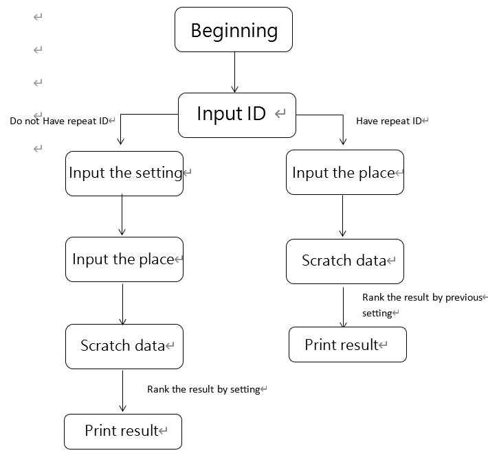

# Google API

In this project, I am going to utilize google api to help user to know how to **What is the best way to get home?**. There are many factors that can affect a person's way of getting home. The following are the factors that we think impact the most.
* Weather
* Fare
* Destination
* Time

Thus, we probide the above information to user to help them determine which is the best way.
## System Flowchart

## Used S
The following are the langauage we use in this project
* Ptython
* Google API
* Weather bureau API.
* Web crawler
