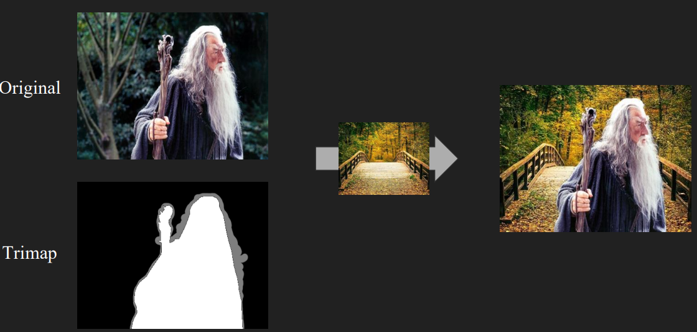

# KNN_Matting
Given a trimap, I need to solve for the unknown areas. In trimap, 255 is for the foreground, and 0 is for background.
## Used Skill
The following are the skill that I used in this project:
* KNN matting algorithm
* Python3
* Scipy

