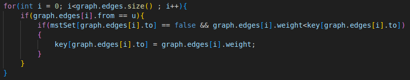

# Prim's algorithm
In here, we would show the result of my work on prim's algorith,
## How does Prim’s Algorithm Work? 
    Step 0: Read the input data
    Step 1: Determine an arbitrary vertex as the starting vertex of the MST.
    Step 2: Follow steps 3 to 5 till there are vertices that are not included in the MST (known as fringe vertex).
    Step 3: Find edges connecting any tree vertex with the fringe vertices.
    Step 4: Find the minimum among these edges.
    Step 5: Add the chosen edge to the MST if it does not form any cycle.
    Step 6: Return the MST and exit

## Performance
|     Dataset     | Prim_serial | Prim_OpenMP | Prim Published | Pthread |
|:---------------:|:-----------:|:-----------:|:--------------:|:-------:|
| random_1000_0.8 |    3.27     |    3.16     |      0.03      |  0.47   |
| random_2000_0.8 |    25.5     |    10.98    |      0.12      |  3.36   |
| random_5000_0.8 |    50.21    |    23.67    |      3.45      |  10.6   |
|  sparse_1000_4  |    2.65     |    2.67     |      0.01      |  0.17   |
|  sparse_2000_4  |    5.33     |    5.33     |    2.36895     |  0.45   |
|  sparse_5000_4  |    13.40    |    13.44    |    3.19734     |  1.69   |
| power_1000_2.5  |    2.63     |    2.69     |      0.01      |  0.19   |
| power_2000_2.5  |    5.33     |    5.36     |      0.03      |  0.38   |
| power_5000_2.5  |    13.32    |   13.3647   |      0.40      |    2    |

## Performance
|     Dataset     | boruvka_serial | boruvka_parallel |
|:---------------:|:-----------:|:-----------:|
| random_1000_0.8 |    0.048     |    0.037     |
| random_2000_0.8 |    0.019     |    0.014     |
| random_5000_0.8 |   0.29    |    0.37     |
| sparse_1000_4 |    0.05     |    0.11     |
| sparse_2000_4 |    0.35     |    0.65     |
| sparse_5000_4 |    6.27     |    10.33     |
|  pow_1000_2.5   |    0.15     |    2.99     |
|  pow_2000_2.5   |    1.45     |    2.37     |
|  pow_5000_2.5   |    18.08     |    30.42     |
| |ElogV|EV/klogV|

## Analysis
We can find that the hotpot locate at here:

### OpenMp
In this stage, we need to iterate over edge. It is time consuming.
We utilize OpenMp to devide this section. As we can see, In scenarios with a higher density of edges, the improvement in performance becomes more noticeable.
### Citation
[reference paper](https://www.reed.edu/biology/courses/bio331/files/projects/fall2016/lopez.pdf)

